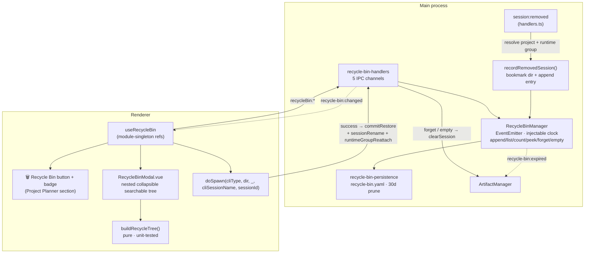

# Recycle Bin (closed recoverable sessions)

Closing a session that carried a `cliSessionName` (its CLI-internal resume UUID)
snapshots it into a rolling **30-day** bin instead of losing it. Restoring reuses the
normal spawn-with-resume flow, so a recovered session is indistinguishable from one
resumed at startup.

## Why this exists

A hub session is a thin wrapper around a CLI conversation. When it carries a
`cliSessionName`, the *conversation still exists on disk* inside the CLI — closing
the hub session only throws away the handle. Before the bin, an accidental close (or
a close-and-then-changed-my-mind) meant that handle was gone and the conversation was
effectively unreachable, even though nothing had actually been deleted.

Ephemeral sessions (no `cliSessionName`) have nothing to come back to, so they are
**never** recorded — a bin full of unrestorable rows is worse than no bin.

The 30-day window mirrors the `ScheduledTaskHistoryManager` rolling-window pattern:
prune on append, and defensively re-filter on load so the file cannot grow unbounded
if pruning was ever skipped.

## Architecture



## What gets recorded

`recordRemovedSession(event, recycleBin, bookmarkDir, runtimeGroup?, project?)`
(`src/session/recycle-bin-manager.ts`) is the single wiring helper for the
`session:removed` event. It keeps two side effects together and unit-testable:

1. **Auto-bookmark** the working directory (so the group header persists with 0
   active sessions), and
2. **Append the bin entry** — under exactly the same condition: the session had both
   a `cliSessionName` **and** a `workingDir`. Otherwise it returns `null`.

`RecycleBinEntry` (`src/types/recycle-bin.ts`):

| Field | Why it is captured |
|---|---|
| `id` | The bin entry's own UUID — distinct from the session id |
| `sessionId` | The original hub session id — **reused on restore** (see below) |
| `name`, `cliType`, `workingDir` | Enough to re-spawn |
| `cliSessionName` | Passed as `resumeSessionName` — the actual recovery key |
| `closedAt` | Retention key + "closed Xm ago" display |
| `projectId?` / `projectName?` | Snapshotted at close so the tree renders without re-resolving, and survives a later project rename |
| `runtimeGroupId?` / `runtimeGroupName?` | So restore can re-attach, recreating the group by id+name if it was closed meanwhile |

**Project resolution uses `findByPath` / `getById`, never `resolveForPath`.** The
comment in `handlers.ts` states the reason plainly: `resolveForPath` would *create* a
project, so a close event could spawn a phantom project. Closing a session must never
have that effect.

After recording, the session is evicted from its runtime group via
`runtimeGroupManager.removeSessionEverywhere(sessionId)` — the tag on the bin entry
is what remembers the association.

## Restore is a two-phase transaction

Restore does **not** remove the entry up front:

1. `recycleBin:restore(id)` → **`peek`** — returns the entry, leaving it in the bin.
2. The renderer calls
   `doSpawn(entry.cliType, entry.workingDir, undefined, entry.cliSessionName, entry.sessionId)`
   — the identical path used by startup auto-resume.
3. Spawn failed (`!spawnedId`) → **return early, entry stays in the bin**, retryable.
4. Spawn succeeded → `recycleBin:commitRestore(id)` removes the entry.
5. `session:rename(spawnedId, entry.name)` re-applies the **display name the session
   was closed under** (see below).
6. If tagged, `runtimeGroupReattach({ runtimeGroupId, runtimeGroupName }, spawnedId)`
   re-adds it to its runtime group, recreating the group if it is gone.

A `restoring` set guards against double-clicks.

### Name reuse

`pty:spawn` names every new session after its `cliType`, so a restored session would
otherwise come back as "claude-code" and lose whatever the user called it. Step 5
re-applies `entry.name` — skipped when the name is blank or is just the `cliType`
(nothing was ever customised). The rename is non-fatal: the session is already back,
so a failure logs and lets the group re-attach proceed. This mirrors startup
auto-resume, which renames the same way after `doSpawn`.

> **Note vs. CLAUDE.md decision 28**, which describes 4 IPC channels and a restore
> that "returns the entry and removes it". The code has **5** channels: restore was
> split into `restore` (peek) + `commitRestore` (forget), precisely so a failed
> re-spawn cannot destroy the entry — and with it the session's preserved artifacts.

### Session id reuse

Restore deliberately reuses the **original session id**. Anything keyed by session id
— most importantly the session's preserved **artifacts** — comes back attached with
no re-keying. This is the same thing startup auto-resume does.

## Artifact lifecycle coupling

Artifacts are ephemeral per-session reports, and their lifetime is bound to the bin:

| Event | Artifacts |
|---|---|
| Recoverable close (entry created) | **Kept**, under the same session id |
| Non-recoverable / ephemeral close | Cleared immediately (`if (!binned) artifactManager.clearSession(...)`) |
| Restore | Kept — the reused id owns them again |
| `recycleBin:forget` | Cleared (session id resolved **before** forgetting) |
| `recycleBin:empty` | Cleared for every binned session id (snapshotted before emptying) |
| Entry ages out at runtime | `recycle-bin:expired` fires → `clearSession` per expired entry |
| Startup | `pruneOrphanArtifacts` reclaims artifacts whose session is neither live nor in the bin |

The `recycle-bin:expired` event exists because startup pruning only covers restarts;
an entry that crosses the 30-day line while the app is running would otherwise leave
its artifacts stranded.

## Persistence

| Aspect | Detail |
|---|---|
| File | `RECYCLE_BIN_FILE` — `%APPDATA%/Helm/config/recycle-bin.yaml` |
| Shape | `{ entries: [...] }` |
| Write | `atomicWriteFileSync` |
| Load | Rejects a bad shape, then drops entries with `closedAt` outside the window |
| Retention | `RECYCLE_BIN_WINDOW_MS = 30 * 24 * 60 * 60 * 1000` |
| Ordering | In-memory newest-first (`unshift`); `list()` re-sorts by `closedAt` descending |
| Clock | Injectable `now: () => number` for deterministic retention tests |

## IPC channels

| Channel | Purpose |
|---|---|
| `recycleBin:list` | All entries, newest close first (returns `[]` on error) |
| `recycleBin:restore(id)` | **Peek** the entry — does not remove it |
| `recycleBin:commitRestore(id)` | Remove the entry after a successful re-spawn; artifacts stay |
| `recycleBin:forget(id)` | Permanently delete the entry **and** its artifacts |
| `recycleBin:empty` | Delete everything, clearing all binned sessions' artifacts |
| `recycle-bin:changed` | Main → renderer event, broadcast to every live window |

Exposed to the renderer through a `recycleBin` preload domain.

## UI

A **🗑️ Recycle Bin** button with a live badge count sits in the Project Planner
section (bottom-left) and opens `RecycleBinModal.vue`.

The modal is a **nested, collapsible, searchable tree** —
`Project ▸ Runtime Group ▸ Folder ▸ sessions`, with ungrouped folders sitting at
project level with no group wrapper. It is built by the pure, unit-tested
`renderer/recycle-bin-tree.ts`:

```
buildRecycleTree(entries, resolveProject, query)
  → RecycleProjectNode[] → RecycleGroupNode[] → RecycleFolderNode[] → RecycleBinEntry[]
```

- `resolveProject` prefers the entry's **stored** project, falling back to a
  `state.projects` working-dir lookup for legacy entries (written before
  `projectId`/`projectName` existed), else the synthetic `(no project)` bucket
  (`NO_PROJECT_ID` / `NO_PROJECT_NAME`).
- Ordering is deterministic, newest-first at every level.
- Every level folds independently with a live descendant count.
- The search box filters across name / CLI / path and auto-hides emptied levels; the
  header count switches to **"N shown · last 30 days"**.
- Rows show name + a plain-text CLI badge, the full working-dir path (tooltip +
  ellipsis), an optional runtime-group chip, and
  `closed Xm ago · yyyy/mm/dd HH:mm`.
- Per-folder **↺ Restore all** / **🗑 Forget all** simply loop the single-entry IPC.
- Empty state: "No closed sessions to restore".

**Expiry is deliberately not surfaced.** No countdown, no colour bars. Retention is
the manager's concern; showing a ticking clock would turn a safety net into a
deadline the user feels obliged to manage.

Reactive state lives in `renderer/composables/useRecycleBin.ts` — module-singleton
refs shared by the badge and the modal, so the count is never stale relative to the
list.

## Key modules

| File | Role |
|------|------|
| `src/types/recycle-bin.ts` | `RecycleBinEntry` |
| `src/session/recycle-bin-manager.ts` | `RecycleBinManager` + `recordRemovedSession` |
| `src/session/recycle-bin-persistence.ts` | YAML load/save, `RECYCLE_BIN_WINDOW_MS` |
| `src/session/recycle-bin-manager.test.ts`, `recycle-bin-persistence.test.ts` | Retention, recording condition, serialisation |
| `src/electron/ipc/recycle-bin-handlers.ts` | 5 IPC channels + artifact coupling |
| `src/electron/ipc/handlers.ts` | `session:removed` wiring (project + runtime-group resolution) |
| `src/session/artifact-orphan-prune.ts` | `pruneOrphanArtifacts` at startup |
| `renderer/recycle-bin-tree.ts` | Pure tree builder |
| `renderer/composables/useRecycleBin.ts` | Reactive state + the restore transaction |
| `renderer/components/sidebar/RecycleBinModal.vue` | The tree UI |
| `renderer/screens/sessions-spawn.ts` | `doSpawn` — shared with startup resume |

## Distinct from

- **Runtime Groups** — the bin *tags* entries with a group so restore can re-attach,
  but grouping is a separate concern.
- **Plan Backup & Restore** — per-directory plan snapshots, also rolling-window, but
  restoring replaces data rather than resurrecting a process.
- **Scheduled Task History** — 7-day, read-only evidence; nothing is restorable.
