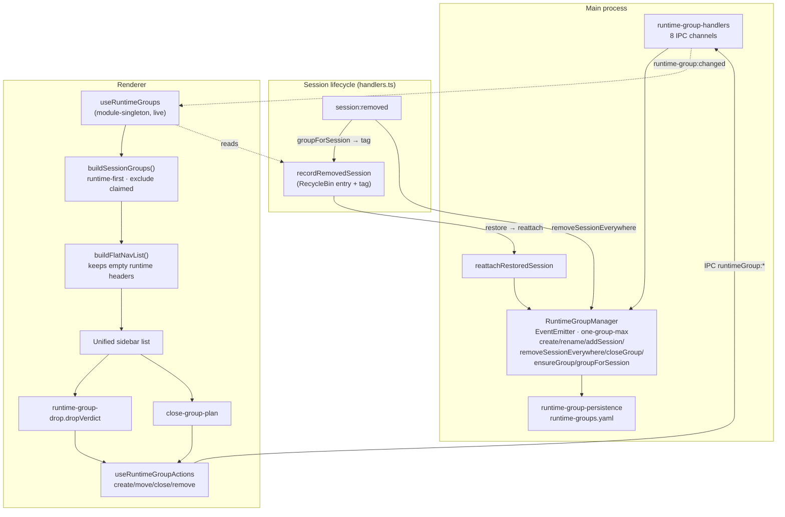

# Runtime Session Groups

Custom, user-created groups that cut **across** working directories, living in the
same unified sidebar list as the default directory (folder/project) groups.

Where directory groups are *derived* from each session's `workingDir`, runtime
groups are *curated* by the user — a place to gather sessions that belong together
conceptually (an "auth refactor sweep", a "release checklist") regardless of which
repo each session runs in.

## Model

- **Exclusive membership.** A session belongs to **at most one** runtime group.
  Moving it into a group evicts it from any prior group *and* removes it from its
  directory group (it renders only under the runtime group).
- **Groups persist independently of membership.** An empty runtime group stays
  visible (header + "No active sessions" placeholder) — it is only removed by an
  explicit close. This is what gives closed sessions somewhere to be *restored to*.
- **Restore-to-group.** When a grouped, recoverable session (one with a
  `cliSessionName`) is closed, its Recycle-Bin entry is tagged with the group.
  Restoring it re-adds the fresh session to that group — **recreating the group by
  id + name if it had been closed in the meantime**. One rule covers three cases:
  restore-into-existing, restore-after-delete, and close-all.

```
RuntimeGroup { id, name, sessionIds[], collapsed, createdAt, updatedAt }
  → %APPDATA%/Helm/config/runtime-groups.yaml   ({ groups: [...] }, global)

RecycleBinEntry { …, runtimeGroupId?, runtimeGroupName? }   // the restore tag
```

## Architecture



## UI

| Element | Behaviour |
|---------|-----------|
| **Unified list** | Runtime groups render first, then directory groups. No section dividers. `SessionGroup` branches its header on `kind: 'runtime' \| 'directory'`. |
| **Split button** `[ ▦ Overview \| ＋ New Group ]` | Top of the list. **Overview** opens a global preview grid of *all* live sessions. **New Group** creates a group — and is itself a drop target (dropping a card creates a group prefilled with that session). |
| **Runtime header controls** | Always-visible **▸** (overview of this group's members) · **✎** rename · **✕** close. |
| **Empty group** | Header stays with a "No active sessions" placeholder and an **✕** to close it. |
| **Drag to move** | The whole session card is draggable (no handle). Drop targets highlight green (valid) / red-dashed (invalid). Rules live in `runtime-group-drop.ts`. |
| **Context menu** | "🗂️ Move to group ▸" submenu (lists groups, ✓ current, + "New group…") and "↩ Remove from *group*" when grouped. |
| **Group badge** | A session in a runtime group shows a 🗂️ badge on its card. |

### Drag drop rules (`dropVerdict`)

| Drop a session onto… | Result |
|---|---|
| A runtime group header | Move in (auto-evicts from any prior group) |
| The **＋ New Group** segment | Create a group, then move the session in |
| Its **own** folder header | Remove from the runtime group → back to its directory |
| A **different** folder header | ❌ Rejected — a session's `workingDir` is fixed; it can't be relocated across folders |
| The group it's already in | ❌ No-op |

### Closing a runtime group

Closing an **empty** group removes it silently. Closing a group **with sessions**
opens a 3-way dialog:

1. **Cancel** — nothing happens.
2. **Close group, keep sessions** — the group is removed; its sessions revert to
   their directory groups.
3. **Close group and all its sessions** — each member is closed via the canonical
   `sessionClose` path **first** (so recoverable ones land in the Recycle Bin
   *tagged* with the group), and only **then** is the group removed. Ordering is
   enforced by `buildCloseGroupPlan` (`close-group-plan.ts`) — removing the group
   before closing the sessions would lose the tag.

## Gamepad

Runtime-group headers are ordinary nav-list items, so D-pad navigation, **▸ / D-pad
Right** overview, and collapse work through the existing flow. **Moving** a session
into a group is mouse/context-menu only (drag needs a pointer); there is no
gamepad "grab-and-carry" mode.

## Key modules

| File | Role |
|------|------|
| `src/types/runtime-group.ts` | `RuntimeGroup` interface |
| `src/session/runtime-group-manager.ts` | Manager (EventEmitter, one-group-max) |
| `src/session/runtime-group-persistence.ts` | YAML load/save |
| `src/session/runtime-group-restore.ts` | `reattachRestoredSession` (recreate-if-gone) |
| `src/electron/ipc/runtime-group-handlers.ts` | 8 IPC channels + change forwarding |
| `renderer/session-groups.ts` | `buildSessionGroups`, extended `buildFlatNavList` |
| `renderer/composables/useRuntimeGroups.ts` | Live reactive groups (module-singleton) |
| `renderer/composables/useRuntimeGroupActions.ts` | create/move/close/remove flows |
| `renderer/runtime-group-drop.ts` | `dropVerdict` drag rules |
| `renderer/close-group-plan.ts` | Close-group sequencing (tag-preserving order) |
| `renderer/components/modals/RuntimeGroup*.vue` | Name modal, close dialog, move submenu |

## Distinct from

- **Directory/project groups** — derived from `workingDir`; a session is always in
  exactly one, computed not curated.
- **Drafts** — per-session prompt memos.
- **Directory Plans** — per-directory DAG of work items.
- **Recycle Bin** — the 30-day store of closed recoverable sessions; runtime groups
  *tag* bin entries but are a separate concern.
