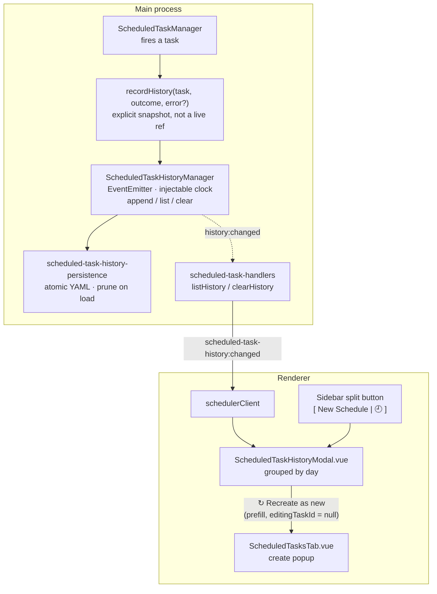

# Scheduled Task History (7-day rolling run log)

Every scheduled-task execution appends an immutable **setup snapshot** to a rolling
7-day log, surfaced as a "Past Schedules" modal with a one-click *Recreate as new*.

## Why this exists

Scheduled tasks fire while nobody is watching, and recurring ones **mutate**: after a
run, `completeOrReschedule` resets the task to `pending` with a fresh `nextRunAt`.
That means the live task object is no evidence of what actually ran — by the time you
look, it describes the *next* run, not the last one.

The history therefore captures the task's **setup fields at fire time**, as an
explicit copy rather than a live reference. Each fire of a recurring or cron task
produces exactly one entry.

**No stdout is stored — intentionally.** PTY output is large, noisy and already
available through the session itself. The history answers *"what did I schedule, when
did it run, and did it work?"* — not *"what did it print"*. Keeping entries small is
what makes an unbounded-by-default log safe to keep on disk.

The rolling window (7 days) mirrors the `PlanBackupManager` pattern already used
elsewhere in the codebase: prune on append, and defensively re-filter on load so a
file that skipped pruning (crash, clock jump, hand edit) cannot grow forever.

## Architecture

## Snapshot contents (`ScheduledTaskHistoryEntry`)

Defined in `src/types/scheduled-task.ts`:

| Field | Notes |
|---|---|
| `id` | UUID for the history entry itself (distinct from `taskId`) |
| `taskId` | The task that fired |
| `title`, `description?` | Setup |
| `initialPrompt` | The prompt the run delivered |
| `cliType`, `cliParams?` | How the session was spawned |
| `dirPath` | Working directory |
| `mode?`, `targetSessionId?` | New-session vs. existing-session run mode |
| `scheduleKind?`, `intervalMs?`, `cronExpression?`, `endDate?` | The schedule as configured at fire time |
| `planIds` | Copied array (`[...task.planIds]`) — not shared with the live task |
| `ranAt` | Epoch ms, the retention key |
| `outcome` | `'done'` \| `'failed'` \| `'cancelled'` |
| `error?` | Present on `failed` |
| `sessionId?` | The session the run produced, when there was one |

Optional fields are spread conditionally (`...(x !== undefined ? { x } : {})`), so
the YAML stays free of `undefined` noise.

## Persistence

| Aspect | Detail |
|---|---|
| File | `SCHEDULED_TASK_HISTORY_FILE` — `%APPDATA%/Helm/config/scheduled-task-history.yaml` |
| Shape | `{ entries: [...] }` |
| Write | `atomicWriteFileSync`; `endDate` serialised as an ISO string |
| Load | Rejects a non-`{entries: []}` shape, then **drops entries older than the window** — the defensive second line of defence |
| Retention | `HISTORY_WINDOW_MS = 7 * 24 * 60 * 60 * 1000` |
| Ordering | In-memory newest-first (`unshift`); `list()` re-sorts by `ranAt` descending |
| Clock | `ScheduledTaskHistoryManager` takes `now: () => number = Date.now` by injection, so retention pruning is deterministic in tests |

## Key modules

| File | Role |
|------|------|
| `src/types/scheduled-task.ts` | `ScheduledTaskHistoryEntry`, `CreateScheduledTaskParams`, schedule kinds/modes |
| `src/session/scheduled-task-history-manager.ts` | `append` / `list` / `clear` / `prune`, emits `history:changed` |
| `src/session/scheduled-task-history-persistence.ts` | YAML load/save + `HISTORY_WINDOW_MS` |
| `src/session/scheduled-task-history-manager.test.ts` | Retention + ordering tests |
| `src/session/scheduled-task-history-persistence.test.ts` | Serialisation + defensive-load tests |
| `src/session/scheduled-task-manager.ts` | `recordHistory()` — the fire-time snapshot |
| `src/electron/ipc/scheduled-task-handlers.ts` | `scheduled_task:listHistory` / `clearHistory`, forwards `scheduled-task-history:changed` |
| `renderer/components/sidebar/ScheduledTaskHistoryModal.vue` | Past Schedules UI |
| `renderer/components/sidebar/ScheduledTasksTab.vue` | Create popup (target of Recreate) |

## Events and IPC

| Name | Direction | Notes |
|---|---|---|
| `history:changed` | Manager → main | Internal EventEmitter event |
| `scheduled-task-history:changed` | Main → renderer | Broadcast by the handler; subscribed in `domain-api.ts` |
| `scheduled_task:listHistory` | Renderer → main | `→ ScheduledTaskHistoryEntry[]`, newest first |
| `scheduled_task:clearHistory` | Renderer → main | Wipes the log |

Note the deliberate name difference: the manager's own event is `history:changed`,
while the channel forwarded to renderers is namespaced `scheduled-task-history:changed`.

## UI

**Entry point.** The sidebar "New Schedule" control is a **split button**; the 🕘
segment opens the Past Schedules modal. Putting history behind the same control as
creation keeps the two adjacent — the most common reason to look at history is to
run something like it again.

**The modal** (`ScheduledTaskHistoryModal.vue`):

- Runs grouped by day, with **Today** / **Yesterday** / an explicit date as the group
  heading.
- Each row: an **outcome badge** (done / failed / cancelled), the ran-at time, setup
  chips (CLI type, directory, schedule kind, mode…), a prompt preview, and the error
  text when `outcome === 'failed'`.
- **Clear history** button, disabled when the log is empty.

**↻ Recreate as new.** Prefills the `ScheduledTasksTab` create popup from the
snapshot with `editingTaskId` left `null`, defaulting the scheduled time to **now +
1 hour**. Nothing is created until the user confirms. This is a *template* action,
not a re-run: the original task may have been deleted, edited, or may still be live,
and silently mutating it from a history view would be a surprise.

## Distinct from

- **Scheduled Tasks** themselves (`ScheduledTaskManager`, `scheduled-tasks.yaml`) —
  the live, mutable list of what *will* run.
- **Plan Backup & Restore** — the same rolling-window shape, but for plan data, and
  restorable. History is read-only evidence; there is no "restore a run".
- **Recycle Bin** — closed sessions, 30-day window, restorable.
